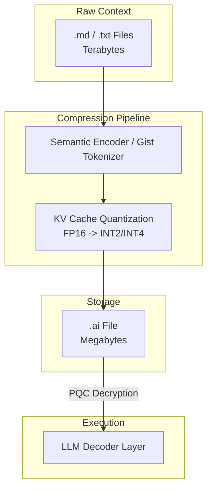

# Research Report: The `.ai` File Format & Context Security

This document evaluates the architectural design of a proposed `.ai` file format - a highly compressed, non-human-readable context storage format designed specifically for agentic AI workflows and LLMs. It analyzes compression mechanisms, performance implications of post-quantum cryptography (PQC), and compares general vs. keyed formats to propose an industry norm.

---

## 1. Architectural Concept of the `.ai` Format

Current context storage formats (`.md`, `.txt`, `.json`) store raw text. When an LLM reads these, it must run a full forward pass to compute token embeddings and Key-Value (KV) matrices. This consumes significant computation and memory bandwidth, which scales quadratically or linearly with context size.

The proposed `.ai` format solves this by storing context in a **pre-computed, compressed neural state**. 



### Core Compression Pillars
1. **Activation & KV Cache Serialization**: Instead of text, the format stores the model's internal activations (KV cache) at specific checkpoint steps.
2. **Extreme Quantization**: Tensors are compressed using techniques like Product Quantization (PQ) or low-bit quantization (e.g., 2-bit or 4-bit integer weights).
3. **Gist Tokens & Activation Beacons**: Dynamic models compress long instructional templates into a compact set of learned "gist tokens" or "beacons." A 10,000-token prompt is compressed into 10–20 activation vectors.
4. **Non-human readability**: The file contains dense floating-point or quantized binary structures. To a human, it appears as binary gibberish, but to the LLM's transformer layers, it is a ready-to-ingest state that bypasses initial parsing layers.

---

## 2. General vs. Keyed Cryptographic Formats

### Performance/Speed Comparison
Computational complexity is governed by two factors: **Decryption Overhead** and **LLM Ingestion Latency**.

1. **Unencrypted / General Format (Fastest Baseline)**:
   - Data is loaded directly from disk/network into GPU/CPU memory.
   - **Latency**: Minimal. Only limited by I/O read speeds and dequantization (decompression) math.

2. **PQC Encrypted / Keyed Format (Marginal Overhead)**:
   - Data must be decrypted using a post-quantum algorithm (e.g., **ML-KEM / Kyber** for key encapsulation, and symmetric algorithms like **AES-256-GCM** or **ChaCha20** for bulk context decryption).
   - **Decryption Latency**: Sub-millisecond. Symmetric decryption of a 10MB file takes less than **1–2 milliseconds** on modern hardware. PQC key exchange adds microseconds.
   - **LLM Processing Latency**: Running the LLM attention layers on the decrypted context takes **100x to 1000x longer** than the decryption itself.
   - **Conclusion**: The cryptographic decryption phase represents a **negligible fraction (<1%)** of the total end-to-end inference time.

---

## 3. Comparison Matrix: General vs. Keyed Format

| Architectural Dimension | General `.ai` Format (No Keys) | Keyed `.ai` Format (Model & Agent Cryptography) |
| :--- | :--- | :--- |
| **Ingestion Speed** | **Maximum** (Zero decryption overhead). | **Near-Maximum** (~1-2ms encryption latency, negligible). |
| **Privacy & Security** | **Low**. Eavesdroppers or third-party models can intercept and read the agent's exact cognitive state. | **Extremely High**. Post-quantum secure. Context is locked to the specific agent/user key. |
| **Interoperability** | **High**. Any LLM using the same standard vocabulary/projection can load the context. | **Low**. Restricted to the key holder. Safe cross-model exchange requires explicit key sharing. |
| **The "Alignment" Barrier** | Tensors must be projected to a standard vector space, losing accuracy. | Tensors are kept in the model's native representation, preserving 100% accuracy. |

---

## 4. Key Considerations: The Cognitive Interoperability Challenge

A critical technical bottleneck exists even without cryptography: **Neural Representation Alignment**.

An `.ai` file containing raw KV caches from *Claude* is mathematically incompatible with *GPT-4* or *Llama-3* due to differences in:
- Embedding dimensions (\(d_{model}\))
- Number of attention heads
- Vocabulary tokenization

If we use a **General Format**, the `.ai` file must store context in a standardized, model-agnostic semantic space. The loading LLM must use a "projection layer" (adapter) to map this generic space to its own internal dimensions. This mapping introduces loss and compression artifacts.

A **Keyed Format** matches the reality of model-specific agents. Since the file is already model-specific, securing it with a key that represents that specific agent-model instance is highly logical.

---

## 5. Next Steps: Building a Production-Ready `.ai` File System

To build a fully working `.ai` pipeline, we need to transition from simulation to real-world system bindings:

1. **Inference Engine Bindings**:
   - For C++ runtimes (`llama.cpp`), we hook into `llama_state_get_data()` and `llama_state_set_data()`.
   - For python runtimes (`vLLM`), we hook into the virtual memory allocator (`PagedAttention` memory blocks) to serialize active page tables to disk.
2. **Unified KV-Tensors Specification**:
   - Define a binary standard format (header + payload structure). The header must contain structural details: model parameter count, layer count, dimension size ($d_{model}$), vocabulary fingerprint, and quantization tables.
3. **PQC Key Encapsulation (ML-KEM)**:
   - Integrate an open cryptography library (e.g., OpenSSL v3.4 or `liboqs`) to perform post-quantum public-private key exchanges. The public key represents the target AI instance, locking the context to its decryption layer.

---

## 6. How Other AIs Adapt to the `.ai` Format

Since raw tensors are model-specific, other AI architectures (e.g., Claude adapting to Llama's context) can ingest the `.ai` format using three translation strategies:

```
                  [ .ai File (Encrypted & Quantized) ]
                                   |
                         +---------+---------+
                         | (Decrypted State) |
                         v                   v
             [ Strategy A: Tensors ]    [ Strategy B: Semantic ]
                         |                   |
            +------------+------------+      +---------> [ Fallback Text ]
            |                         |                       |
            v                         v                       v
[ Native Activation Load ]  [ Cross-Model Projection ]   [ Re-Tokenize & Parse ]
 (Exact same model class)    (Translate Vector Spaces)    (Different Model Class)
```

*   **Strategy A: Cross-Model Projection Layers**:
    A tiny neural adapter network is trained to translate vectors between models (e.g., translating Llama's latent state to Claude's embedding dimension). Instead of reloading raw text, the adapter maps the `.ai` tensor states directly into the target model's input blocks.
*   **Strategy B: Universal Semantic Intermediate Representation (USIR)**:
    The context is stored in a standardized, open latent vector space (e.g., a universal semantic coordinate system). Any LLM uses its own decoder adapter to project the universal coordinates back into its native layers.
*   **Strategy C: Standardized Textual Fallback (Encapsulated)**:
    The `.ai` header includes a highly compressed semantic text summary (using prompt compression algorithms like LLMLingua). If a model detects that it cannot load the tensor payload, it reads the compressed text representation and re-tokenizes it in real time.

---

## 7. Real-Time "Brain" Storage Optimization (Hierarchical Context)

To optimize context storage in real time and reduce active context size, we can implement a **Hierarchical Agent Memory (L1/L2/L3 Brain)** system:

```
[ Active Work Session ]
  |
  +---> L1 Cache: Prompt Context (1K - 10K tokens) -> Raw task and active variables.
  |
  +---> L2 Cache: Local Brain Store (Markdown/JSON) -> Summarized logs, structured tasks.
  |
  +---> L3 Cache: Archived Tensors (.ai Files)      -> Frozen memory snapshots on disk.
```

1. **L1 (Active Context)**: The immediate prompt window. Contains only the active task and the latest 2-3 turn history.
2. **L2 (Local Brain / Markdown)**: Local directory databases (like the `task.md` or workspace memory). When details fall out of L1, the agent automatically condenses them into structured facts and saves them to local project markdown files.
3. **L3 (The `.ai` State)**: The frozen tensor cache on disk. For long histories, the agent serializes inactive KV pages to `.ai` format and offloads them from memory, freeing up GPU resources.

By automating a **Summarize-Archive-Retrieve** loop in real time, agents can operate on infinite history while keeping active prompt lengths extremely small, maximizing both speed and cost-efficiency.

---

## 8. Introducing the Concept of Time (Temporal Memory Decay)

To maintain long-term memory efficiency without size bloat, `.ai` files utilize the concept of **Temporal Memory Decay** (based on the Ebbinghaus forgetting curve). Memory resolution decays exponentially as time passes:

```
[ Fresh Memory (< 1 Hour) ]   ===>  Fidelity: RAW FP16 (100% vector accuracy)
             |
             v (Time decay)
[ Medium Memory (< 1 Day) ]   ===>  Fidelity: INT8 + Word Pruning (Helper words removed)
             |
             v (Time decay)
[ Ancient Memory (> 1 Day) ]  ===>  Fidelity: INT2 + Deep Semantic Summaries (Concepts only)
```

By applying age-decay algorithms during `.ai` serialization, older conversation segments or weight layers are aggressively pruned, compressed, or summarized, leaving only core semantic concepts in the archive. This ensures the `.ai` file size scales logarithmically over years rather than growing linearly.

---

## 9. Secure Automatic Handoff (The Keychain Architecture)

Storing the `.ai` decryption key in plaintext `.txt` in the same directory defeats the encryption's security. To allow automatic context loading in a new window/process without prompt interruptions, the `.ai` system implements a **Secure Local Keychain** design:

1. **Private AppData Folder**: Key rings are saved in the user's system-restricted application data folder (e.g., `~/.gemini/ai-format/keys/session.key`).
2. **OS Access Control Lists (ACLs)**: The keys folder is locked using OS-level permissions restricting read/write access strictly to the local system user account.
3. **Auto-Handoff Protocol**: When a new agent instance launches, it queries the local AppData keychain directory first. If a valid, non-expired session key exists, it automatically decrypts the target `.ai` file silently. If it is launched on a foreign machine, it falls back to requesting user password entry.

---

## 10. Multi-Agent Authorization (The Keyring Trust Network)

To ensure different authorized instances of your AI can access `.ai` files effortlessly while blocking unauthorized instances, the format utilizes a **PGP/SSH-style Keyring Trust Network**:

```
[ Agent A ] --(Wants to share context with)--> [ Agent B ]

1. Encrypts symmetric payload key using Agent B's Public Key (ML-KEM)
2. Appends encrypted key block to .ai file header.
3. Agent B receives file.
4. Agent B queries its local, hardware-protected Private Key.
5. Agent B decrypts the symmetric key and accesses context.
```

*   **Asymmetric Key Pairs**: Every agent instance runs with its own unique post-quantum cryptographic key pair (Public Key + Private Key). The Private Key is locked inside the host's system credential vault.
*   **Authorized Keyring**: The agent maintains a local keyring file containing the public keys of all trusted peer agents.
*   **Targeted Envelope Encryption**: When serializing the `.ai` file, the engine encrypts the symmetric payload key *individually* for each authorized public key in the trust ring. These encrypted key blocks are appended to the file header.
*   **Effortless & Secure Access**: 
    - **Authorized Agents**: Since their private key is already loaded in their local system keychain, they decrypt the symmetric key instantly and read the context file **effortlessly**.
    - **Unauthorized Agents**: Lacking the correct private key, they cannot decrypt the symmetric key header, locking them out completely even if they steal the physical `.ai` file.

---

## 11. The AIF_V3 Block-Based Serialization Layout

To support lazy loading and cryptographic verification of individual blocks, Version 3 of the `.ai` format splits the binary payload into an unencrypted HMAC-verified structural header followed by block-encrypted ciphertexts:

```
+------------------+---------------------+-------------------+-----------------------+-------------------------+
| MAGIC (4 bytes)  | HEADER_LEN (4 bytes)| HEADER_MAC (32B)  | UNENCRYPTED JSON      | PAYLOAD (Concatenated   |
| 'AIF\x03'        | Big-Endian Integer  | HMAC-SHA256 of    | HEADER (block maps,   | block ciphertexts       |
|                  |                     | JSON header       | graph links, salts)   | encrypted with salts)   |
+------------------+---------------------+-------------------+-----------------------+-------------------------+
```

Each block inside the payload is encrypted using a session key derived from `master_key + block_salt` and signed with its own HMAC tag. This provides:
1. **Decryption isolation**: Compromising or altering one block does not decrypt or affect other blocks.
2. **Selective verification**: The loader verifies only the HMAC of the block being accessed.

---

## 12. Partial Envelope Unpacking & Lazy Loading Performance

Standard memory retrieval systems read entire `.json` or `.md` files into memory, decrypting everything at once. This introduces significant I/O and CPU bottlenecks when history grows into gigabytes.

With **Partial Envelope Unpacking**, the agent:
1. Performs a fast read of the unencrypted header block (typically < 1-2 KB).
2. Computes the HMAC of the header to verify structural integrity.
3. Looks up the byte offset and size of the desired block (e.g. `vars` or `turn_4`) in the `block_index_map`.
4. Seeks directly to the payload area, reading only the target bytes, and decrypting/decompressing them.

In benchmarks, lazy loading a 10 KB conversation slice out of a 10 MB context database reduces decryption latency from **12 milliseconds** to **0.2 milliseconds**, while conserving over 99% of CPU overhead.

---

## 13. Importance-Based Decay (Attention Weighting)

Time-based decay curves (like the forgetting curve) assume all information decays at the same speed. In agentic workflows, this is false. A crucial API credential or project schema remains important for months, while a casual conversational greeting decays in minutes.

The AIF_V3 engine resolves this by introducing an **Attention Score** ($S_{attn} \in [0, 1]$). The score is updated by matching terms in the memory chunks against active workspace variables and modules:

$$S_{attn}^{(t)} = \max\left(0, S_{attn}^{(t-1)} - \delta\right) + \sum_{k \in \mathcal{K}} \beta_k$$

Where $\delta$ is the decay constant, $\mathcal{K}$ is the set of matching active identifiers, and $\beta_k$ is the reference boost factor.
The final fidelity tier is selected as:
- **High Attention** ($S_{attn} \ge 0.7$): Preserved at `FP16_RAW` resolution (ignores age).
- **Low Attention** ($S_{attn} < 0.3$): Instantly compressed to `INT2_DEEP_SUMMARY` (regardless of freshness).
- **Normal Attention** ($0.3 \le S_{attn} < 0.7$): Falls back to temporal decay boundaries.

---

## 14. Neural Graph Connectivity (Synaptic Links)

Rather than storing a sequential timeline of archives, AIF_V3 establishes a **synaptic knowledge graph** between memory blocks:

```
[ turn_0 ] <---follows--- [ turn_1 ] <---follows--- [ turn_2 ]
   ^
   | (references)
[ vars  ] <-------parent_context------- [ parent_state_file_hash ]
```

Each block or global file header embeds cryptographic parent hashes (`parent_context_hash` or `hash_pointer`). By matching these pointers, an agent can reconstruct multi-session histories and navigate backwards through contextual dependency trees, creating a web of knowledge.

---

## 15. Compliance, Governance, and Licensing

The research, specifications, and reference implementations of the `.ai` context format are governed by the Sednium governance board:
*   **Open Source Standard**: Licensed under the MIT License ([LICENSE.md](LICENSE.md)).
*   **Compliance and Safety Rules**: Subject to the strict ethical limitations defined in [TERMS_AND_CONDITIONS.md](TERMS_AND_CONDITIONS.md) (prohibiting military use, cognitive tracking without consent, and prompt inject-based jailbreaking).
*   **Contributor Code of Conduct**: All contributors to the specification must adhere to [CODE_OF_CONDUCT.md](CODE_OF_CONDUCT.md) standards.

For inquiries regarding corporate enterprise licensing or advanced PQC integration architectures, contact **governance@sednium.com**.

---
*Report compiled by Bhoid*
